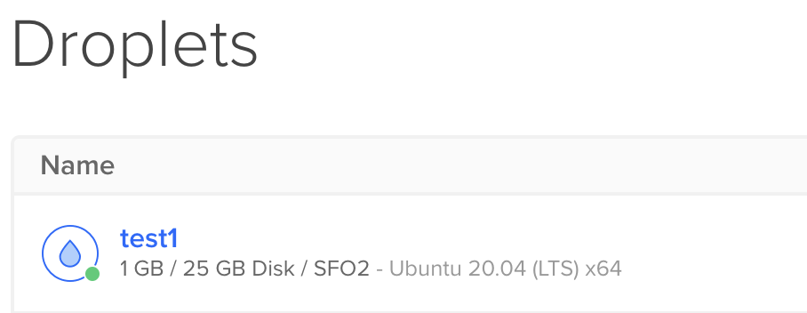
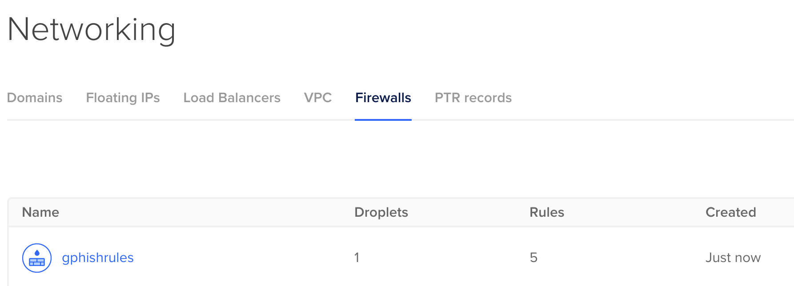
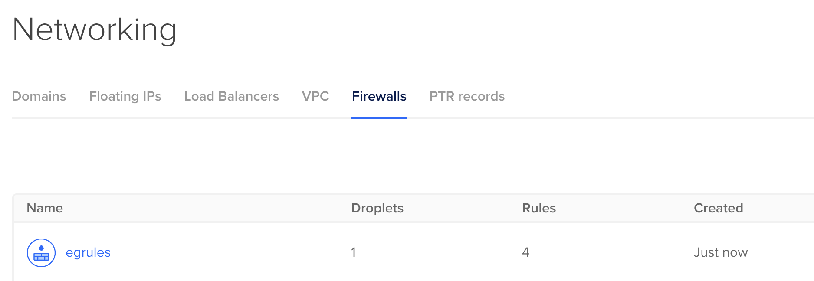

# Terraform_DigitalOcean_Scripts

Bash and terraform scripts to automate standing up C2 infra with firewall settings inside of DigitalOcean.

FYI: Each instance stood up is an Ubuntu 20 DigitalOcean instance.

The scripts were built to be run on either Linux or macOS hosts. The scripts will first check to see if you have installed terraform and if not, it will attempt to install it for you before proceeding.

**NOTE: It is recommended that after running any of the scripts below to stand up your infra that you then ssh into your host, create a local user with sudo, and run any tools as that user. Running tools as root is not recommended**

## Prerequisites

- homebrew (macOS)

- curl

- You will need to setup a DigitalOcean API key (can be done via the web admin console page). Terraform uses your DO API key in order to interface with DO.

- You will also need to set up an ssh key in DigitalOcean (which will be used by terraform to log into the droplet)

## Instructions

> chmod +x *.sh

> ./[name of bash script you want to run]

### Info on the types of scripts included

#### 1. run-ubuntu-behind-firewall.sh

This will setup an ubuntu host in DigitalOcean, create a firewall, and add this host behind the firewall. **This is a general purpose host that can be used for C2.** 

This bash script will gather info such as:
- what you want to name your new droplet, 
- what you want to name your new firewall rule, 
- the src IP (or range) you want to use to login to the droplet (this will restrict access to port 22, 7443, and 8443 to this IP)...I included 7443 and 8443 since some of the C2s in my C2 Cradle use those ports for GUI admin access 
- the name of your DO ssh key (you can set this up in your DO control panel in the admin console web page),
- a redirector IP (or range) (this will restrict access to ports 80 and 443 only to the redirector). If you do not plan on using a redirector, you can just enter "0.0.0.0/0" (or enter your home IP and just change it later in the DO web GUI firewall page)
- the local path to your ssh private key that you use to ssh into DigitalOcean (will be used by terraform to login and install tools once the image is built)

Terraform will install the following in the DO droplet:

- Docker

- curl

- Docker Compose

- git

- my C2 Cradle tool (https://github.com/cedowens/C2_Cradle): This is a tool that includes docker images for various cross platform C2s and will stand up the C2 as a docker image. So you can use this tool to login and install a C2 of your choice (or you can install something else).

Terraform first runs a plan and then apply, so you will need to enter "yes" when prompted to apply:

**once done, you will see a message from terraform indicating succcess:**

You will also be able to see the newly created droplet and firewall in the DO control panel:

Then you can ssh into the droplet and run whatever C2 you choose. If you opt to use my C2 Cradle tool, then you can do the following:

> cd C2_Cradle

> chmod +x run.sh

> sudo ./run.sh

Then pick the C2 server you want to use and the C2 cradle will install it in Docker

--------------------------------

#### 2. run-ubuntu-with-gophish.sh

This will setup an ubuntu host in DigitalOcean, download and install gophish, create a firewall, and add this host behind the firewall. **This is intended to be a gophish host.** 

This bash script will gather info such as:
- what you want to name your new droplet, 
- what you want to name your new firewall rule, 
- the src IP (or range) you want to use to login to the droplet (this will restrict access to port 22 and port 3333 to your IP) 
- the name of your DO ssh key (you can set this up in your DO control panel in the admin console web page),
- the local path to your ssh private key that you use to ssh into DigitalOcean (will be used by terraform to login and install tools once the image is built)

Terraform will install the following in the DO droplet:

- Docker

- curl

- Docker Compose

- git

- golang

- gophish (https://github.com/gophish/gophish)

Terraform first runs a plan and then apply, so you will need to enter "yes" when prompted to apply:

**once done, you will see a message from terraform indicating succcess:**

You will also be able to see the newly created droplet and firewall in the DO control panel:

Then you can ssh into the droplet, cd into the gophish directory and do the following:

- edit the config.json file and change the 127.0.0.1:3333 to 0.0.0.0:3333 (note: the firewall restricts access to port 3333 only to the IP you specify)

- then you can start the server and login with the initial creds:

> sudo ./gophish &

--------------------------------

#### 3. run-ubuntu-with-evilginx2.sh

This will setup an ubuntu host in DigitalOcean, download and install evilginx2, create a firewall, and add this host behind the firewall. **This is intended to be an evilginx2 host.** 

This bash script will gather info such as:
- what you want to name your new droplet, 
- what you want to name your new firewall rule, 
- the src IP (or range) you want to use to login to the droplet (this will restrict access to port 22 and port 3333 to your IP) 
- the name of your DO ssh key (you can set this up in your DO control panel in the admin console web page),
- the local path to your ssh private key that you use to ssh into DigitalOcean (will be used by terraform to login and install tools once the image is built)

Terraform will install the following in the DO droplet:

- Docker

- curl

- Docker Compose

- git

- golang

- EvilGinx2 (https://github.com/kgretzky/evilginx2)

Terraform first runs a plan and then apply, so you will need to enter "yes" when prompted to apply:

**once done, you will see a message from terraform indicating succcess:**

You will also be able to see the newly created droplet and firewall in the DO control panel:

Then you can ssh into the droplet, cd into the evilginx2 directory and do the following:

> sudo ./evilginx2 -p phishlets/

